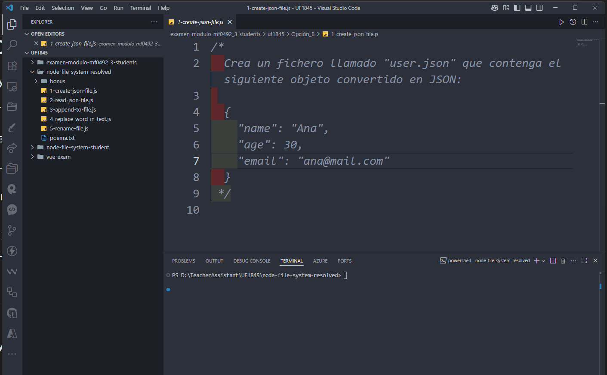
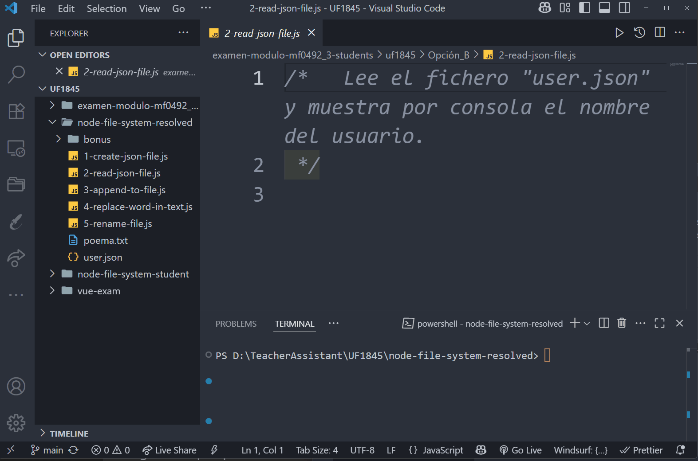
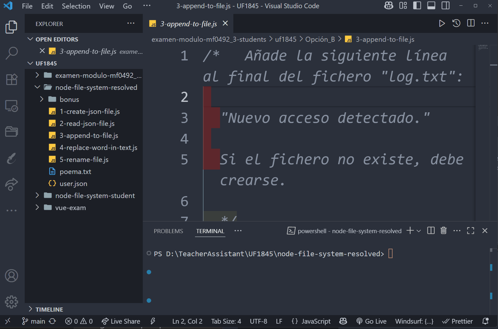
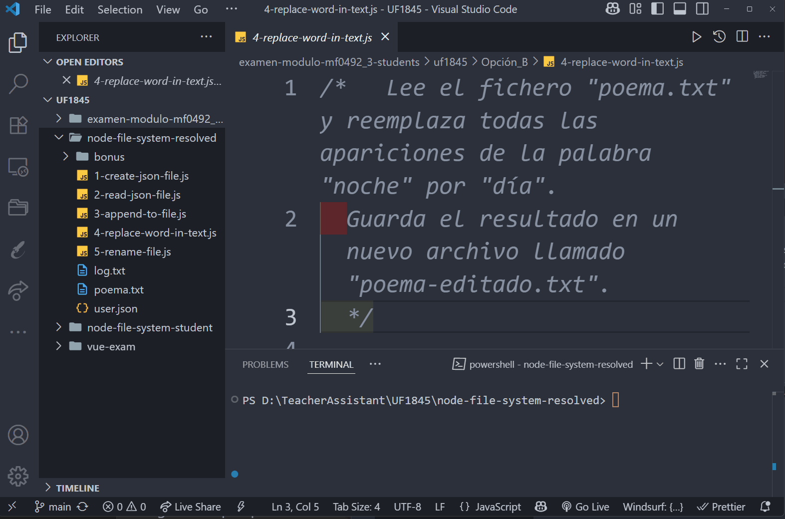
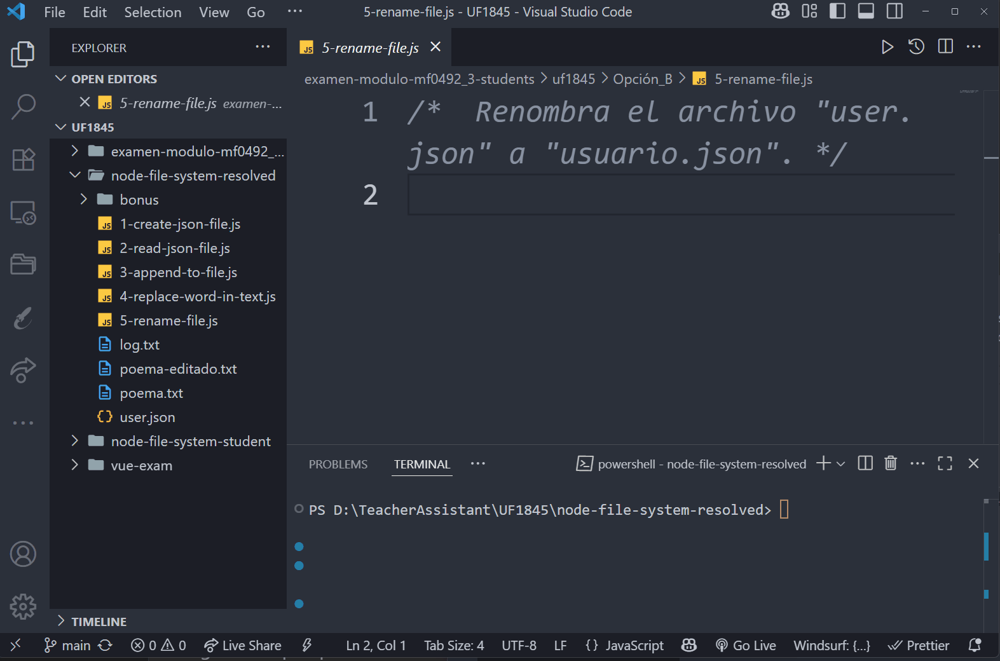
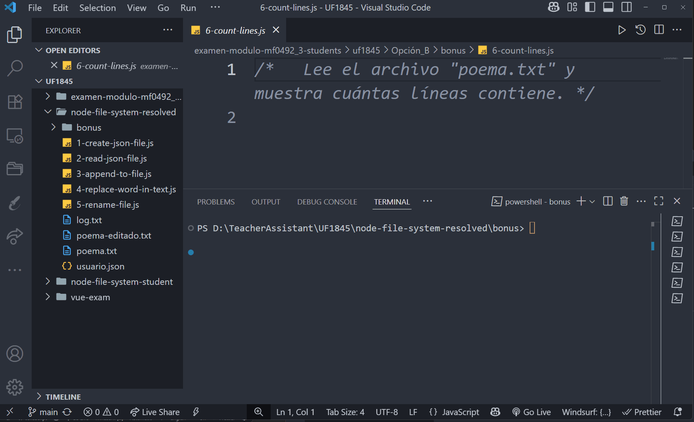
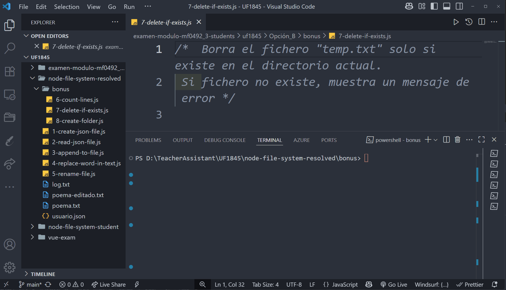
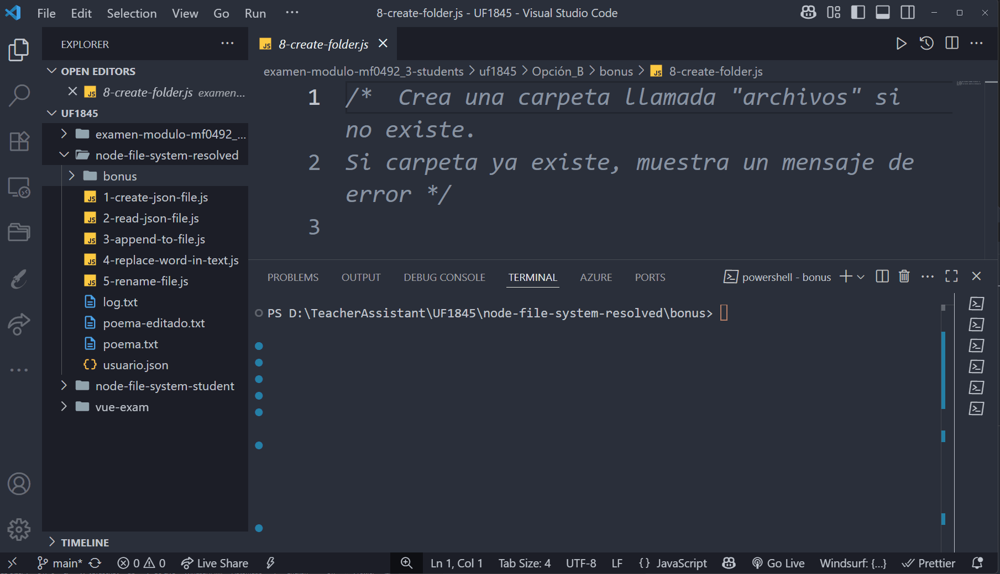

# Ejercicios Node.js (Option B) con resultados esperados

## Ejercicio 1-create-json-file.js

Resultado esperado: 

### Ejercicio 2-read-json-file.js

Resultado esperado: 

### Ejercicio 3-append-to-file.js

Resultado esperado: 

### Ejercicio 4-replace-word-in-text.js

Resultado esperado: 

### Ejercicio 5-rename-file.js

Resultado esperado: 

### Ejercicio 6-delete-file.js

Resultado esperado: 

### Ejercicio 7-delete-if-exists.js

Resultado esperado: 

### Ejercicio 8-copy-file.js

Resultado esperado: 
